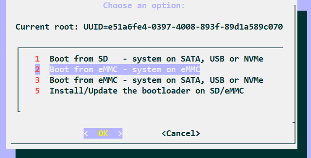

# NanoPC-T4开发记录

## 前言

咸鱼200块淘了块RK3399的T4开发板（裸板），4GRAM，16GBemmc，比起树莓派，价格算很香的了

## 制作外壳

因为没有外壳，官方的外壳售价一言难尽，并且没有预留GPIO的空间，尝试自己画亚克力外壳。先是用了3DMAX，可惜商家需要dwg格式（即需要autoCAD），简单学习就能上手，需要学习rec，dli等命令的使用。同时经过测量需要M3的六角铜柱，以及M3螺丝，螺母。

## 烧录系统

常用的烧录方式有两种（直接将系统安装在SD卡，读写速度有点慢，且步骤相对简单，不作记录）

- 从windows或者linux烧录到emmc

- 从sd卡烧录到emmc

以上两种方式,[官方文档](https://wiki.friendlyelec.com/wiki/index.php/NanoPC-T4)都提供了详细的步骤。
主要记录**在emmc中安装armbian系统**

- 下载或自己编译Armbian的镜像文件。此处推荐内核版本为4.4或4.19，至于原因后续会讲到，如果不想编译，可以直接在官方提供的[链接](https://stpete-mirror.armbian.com/archive/nanopct4/archive/)下载。

- 将镜像写入sd卡。windows平台下推荐使用win32Diskimage，linux平台下推荐使用dd命令，它看起来是这样

  ```shell
  sudo dd if=imagePath of=/dev/sdx bs=4M status=progress
  ```

- 将Armbian系统写入到emmc中。Armbian提供了  armbian-config的工具，命令行执行：

  ```shell
  sudo armbian-config
  ```

  依次选择System--->Install--->Boot from eMMC - system on eMMC

   

等待烧录完成。

## 基本初始化

### apt换源以及armbian换源

参考清华大学开源软件镜像站帮助文档

- [Debian apt换源参考文档]([debian | 镜像站使用帮助 | 清华大学开源软件镜像站 | Tsinghua Open Source Mirror](https://mirrors.tuna.tsinghua.edu.cn/help/debian/))

- [Armbian换源参考文档]([armbian | 镜像站使用帮助 | 清华大学开源软件镜像站 | Tsinghua Open Source Mirror](https://mirrors.tuna.tsinghua.edu.cn/help/armbian/))

### ifconfig普通用户无法执行问题

```shell
vim ~/.bashrc

#在文件末尾添加
export PATH=$PATH:/sbin:/usr/sbin
#保存后命令行执行
source ~/.bashrc
```


## WiringPI for RK3399 安装

参考[官方文档]([WiringPi for RK3399/zh - FriendlyELEC WiKi](https://wiki.friendlyelec.com/wiki/index.php/WiringPi_for_RK3399/zh))

**说明：** 官方的wiringpi for rk3399 的.deb文件通过解包可以发现，官方只为NanoPC-T4开发板适配了4.x内核，这也是为什么推荐安装4.4内核的armbian系统。

## PWM风扇配置

rk3399真的太热了，只配置散热片的情况下，待机状态下，cpu温度都有40摄氏度，所以还是推荐购买官方的PWM风扇，12V供电且开发板预留了接口，有了散热风扇后，cpu35摄氏度左右，除了贵没啥缺点，。以下脚本也只支持4.x内核版本

```shell
#文件路径：/usr/bin
#文件名称：start-rk3399-pwm-fan.sh 
#以下为文件内容：
#!/bin/bash
 
echo $$ > /var/run/fan.pid
 
echo 0 > /sys/class/pwm/pwmchip1/export
 
echo 0 > /sys/class/pwm/pwmchip1/pwm0/enable
echo 50000 > /sys/class/pwm/pwmchip1/pwm0/period
echo 1 > /sys/class/pwm/pwmchip1/pwm0/enable
 
while true
do
        temp=$(cat /sys/class/thermal/thermal_zone0/temp)
        if [ $temp -gt 48000 ]; then
                echo 1000 > /sys/class/pwm/pwmchip1/pwm0/duty_cycle;
        elif  [ $temp -gt 43000 ]; then
                echo 20000 > /sys/class/pwm/pwmchip1/pwm0/duty_cycle;
        elif  [ $temp -gt 38000 ]; then
                echo 30000 > /sys/class/pwm/pwmchip1/pwm0/duty_cycle;
        elif  [ $temp -gt 33000 ]; then
                echo 40000 > /sys/class/pwm/pwmchip1/pwm0/duty_cycle;
        else
                echo 50000 > /sys/class/pwm/pwmchip1/pwm0/duty_cycle;
        fi
        sleep 1s;
done
```

```shell
#文件路径：/lib/systemd/system
#文件名称：pwm-fan.service
#以下为文件内容
[Unit]
Description=pwm-fan
After=rc.local.service

[Service]
Type=oneshot
KillMode=control-group
WorkingDirectory=/tmp
ExecStart=/usr/bin/start-rk3399-pwm-fan.sh

[Install]
WantedBy=multi-user.target
Alias=pwm-fan.service

```

配置开机自启动

```shell
sudo systemctl enable pwm-fan.service
sudo systemctl start pwm-fan.service
```
## 挂载文件系统到nvme

NanoPC-T4板载16G emmc，相比于普通的tf卡，速度要快不少。但是16G又有点太小，好在T4有一个PCIE2.0x4的接口，支持nvme固态（SATA协议的没有验证）。但是，板载并没有SPI Flash，所以并不能直接将引导装在nvme中，所以选择了将文件系统挂载nvme的折中方案。

### Linux开发板系统启动的一般流程

- 引导加载程序 (Bootloader)：负责从固态存储设备上将操作系统加载到RAM中运行，或者通过网络下载操作系统。Bootloader一般分为两个阶段，第一阶段主要完成硬件设备的初始化和RAM空间的准备，第二阶段主要完成内核映像和根文件系统映像的加载和传递参数给内核。

- Linux内核：负责初始化Linux系统，挂载根文件系统，启动init进程。

- 文件系统：包括根文件系统和其他可选的文件系统，存储了Linux系统运行所必需的应用程序、库等。

- 应用程序：特定于用户的应用程序，可以包括嵌入式图形用户界面等。

### 具体操作流程
参考Armbian[官方论坛文章](https://forum.armbian.com/topic/13617-nanopc-t4-boot-from-a-sdcard-use-the-nvme-as-the-root-partition-quick-and-very-dirty/)

## wireguard开机自启动失败

**参考[archLinux论坛](https://bbs.archlinux.org/viewtopic.php?id=266627)**

```shell
# 文件路径：/lib/systemd/system/wg-quick@.service 
# 增加字段：ExecStartPre
[Unit]
Description=WireGuard via wg-quick(8) for %I
After=network-online.target nss-lookup.target
Wants=network-online.target nss-lookup.target
PartOf=wg-quick.target
Documentation=man:wg-quick(8)
Documentation=man:wg(8)
Documentation=https://www.wireguard.com/
Documentation=https://www.wireguard.com/quickstart/
Documentation=https://git.zx2c4.com/wireguard-tools/about/src/man/wg-quick.8
Documentation=https://git.zx2c4.com/wireguard-tools/about/src/man/wg.8

[Service]
Type=oneshot
RemainAfterExit=yes
ExecStartPre=/bin/bash -c '{ exec {sleep}<> <(:); while ! : >/dev/udp/engage.cloudflareclient.com/2408; do read -t 1 -u $sleep; done } 2>/dev/null; exit 0'
ExecStart=/usr/bin/wg-quick up %i
ExecStop=/usr/bin/wg-quick down %i
ExecReload=/bin/bash -c 'exec /usr/bin/wg syncconf %i <(exec /usr/bin/wg-quick strip %i)'
Environment=WG_ENDPOINT_RESOLUTION_RETRIES=infinity

[Install]
WantedBy=multi-user.target
```


