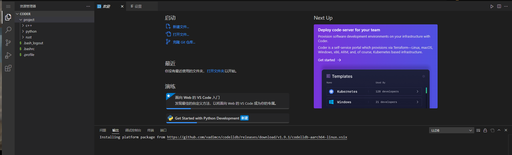

# vscode-web服务与配置



## 前言

如果需要在多台设备之间来进行开发工作，频繁的配置开发环境无疑是很消耗精力的事情。而vscode-web提供了通过浏览器来编写代码的环境，因而理论上，你可以在任何一台机器上继续你的工作。

## 配置过程

### 1.启动docker服务

```bash
docker-compose up -d
```

### 2.进入容器查看密钥

```bash
#进入容器
docker exec -it  code-server bash
#查看密钥
cat ~/.config/code-server/config.yaml 
```

### 3.更换容器的apt源

参考文档：[清华开源软件镜像站Debian Help](https://mirrors.tuna.tsinghua.edu.cn/help/debian/)

```bash
#换源完成后执行
apt update
```

### 4.安装C/C++环境

```bash
apt install build-essential
```

### 5.解决python命令找不到

```bash
ln -s /usr/bin/python3 /usr/bin/python
```

### 6.安装Rust开发环境

```bash
curl --proto '=https' --tlsv1.2 -sSf https://sh.rustup.rs | sh
```

### 7.进入web界面，自行安装喜欢的插件

