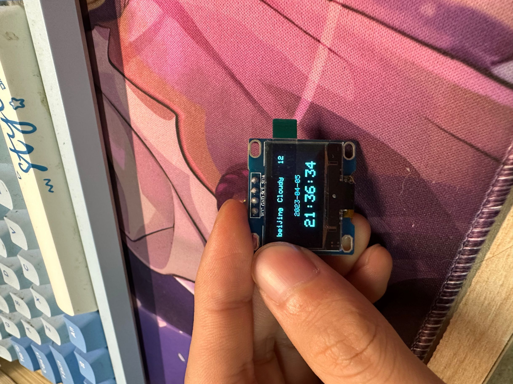
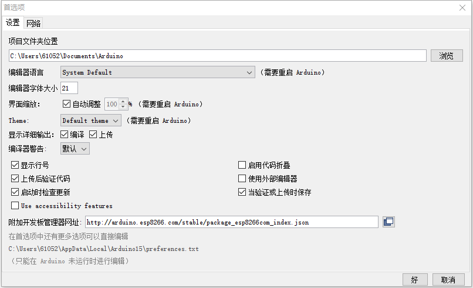
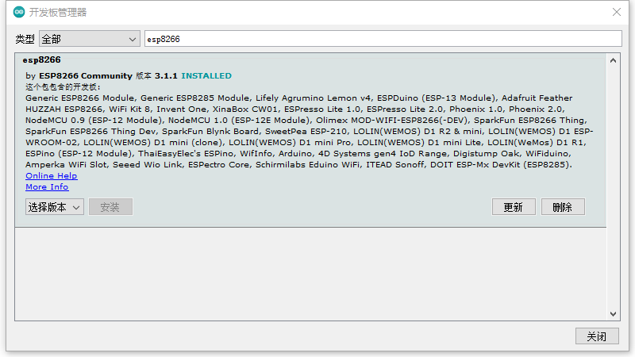
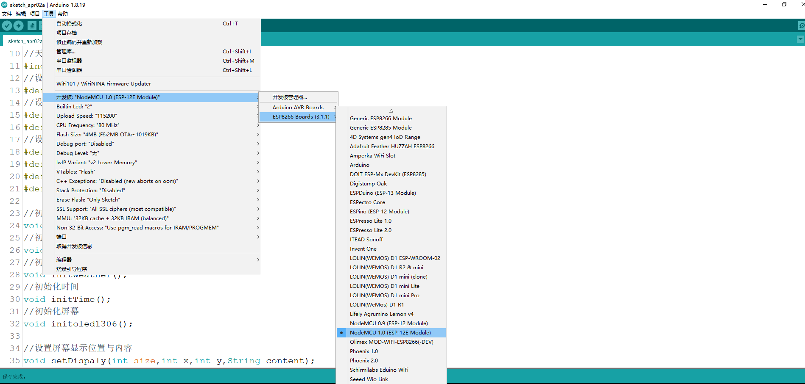
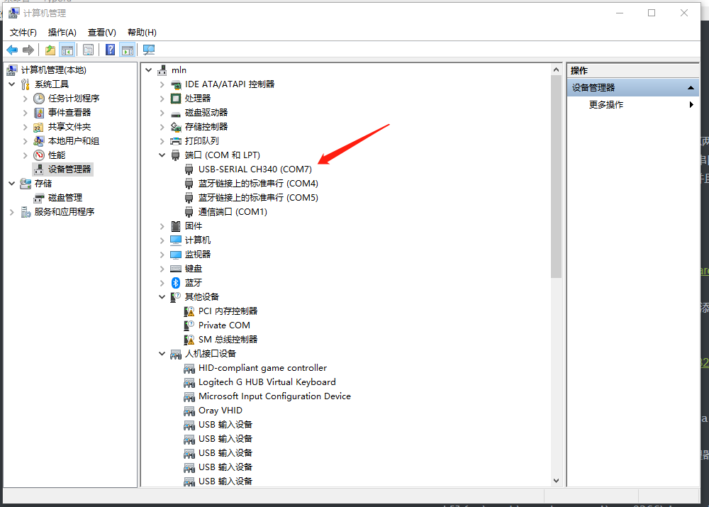
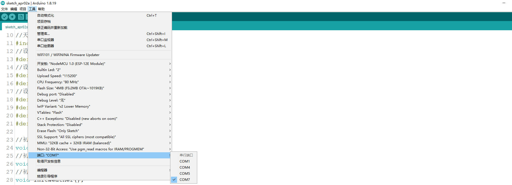
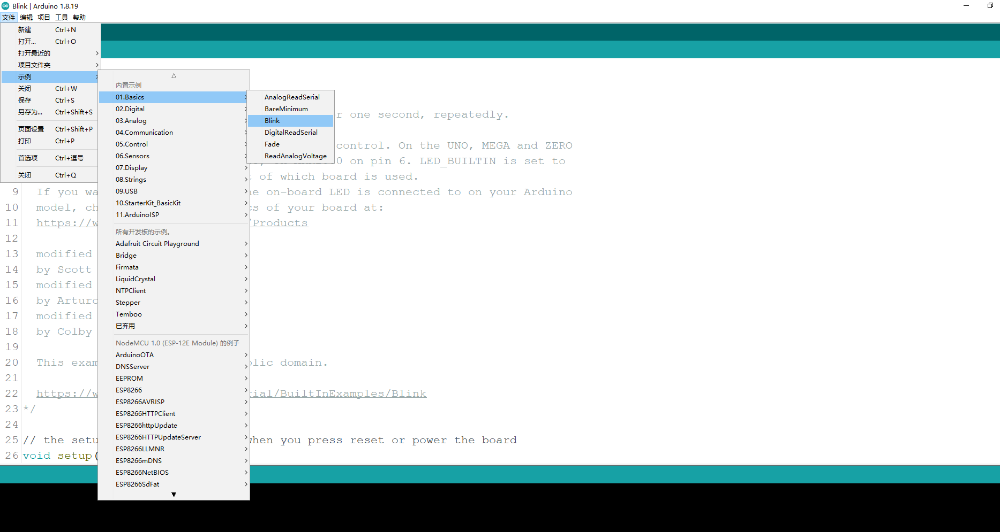
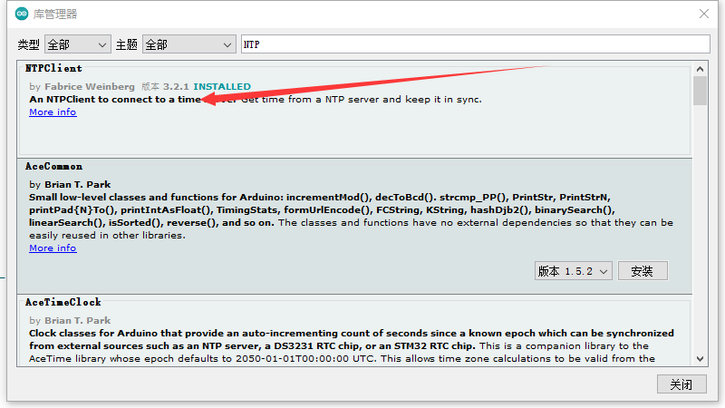
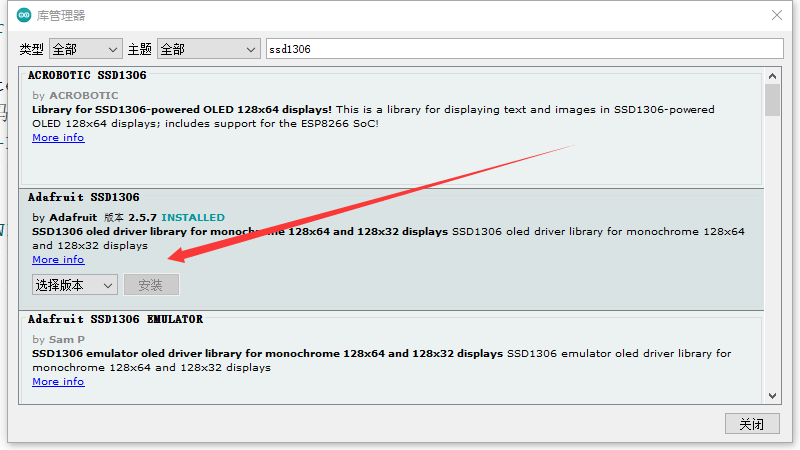
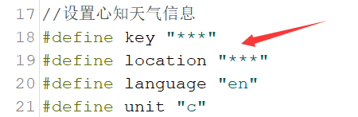

# ESP8266开发记录

---


## 项目材料

ESP8266-12E开发板一块

- ESP8266是一款物联网WiFi芯片(MCU)，常见型号有ESP-01到ESP-13等，每个型号的引脚和功能不同。

SSD1306屏幕一块

- I2C接口的显示屏幕，在Github上有开源驱动的驱动程序

---


## 效果图


---


## 项目功能介绍

- 连接指定WIFI
- 通过NTP服务获取时间并在屏幕上显示
- 通过心知天气提供的API，获取本地实时天气并显示

---


## 开发环境及配置

ESP8266常见开发环境有Arduino IDE和ESP8266 SDK两种。项目使用Arduino IDE这一集成开发环境，优点在于Arduino IDE在安装ESP8266函数库以及串口调试都更为容易。而ESP8266 SDK是乐鑫科技提供的开发工具，需要在Linux下编译开发套件并且需要单独下载串口调试工具等软件，配置相对麻烦。

### Arduino IDE配置

1. 下载 [Arduino IDE](https://www.arduino.cc/en/software)

2. 打开软件->文件->首选项->附加开发板管理器地址，添加
	
	```html
	http://arduino.esp8266.com/stable/package_esp8266com_index.json
	```
	添加完成后，点击好。

	
3. 在Arduino IDE中点击工具->开发板->开发板管理器,在开发板管理器里面搜索esp8266并进行安装
  

4. 在Arduino IDE的开发板菜单中找到“NodeMCU开发板”，选择ESP8266-12E
  

5. 将esp8266通过数据线接入电脑，右键此电脑->管理->设备管理器->端口，查找到开发板的端口号
  

6. 在Arduino IDE中点击工具->端口，选择上面的端口
  

7. 通过Blink实例程序，验证是否搭建完成开发环境
  点击文件->示例->Basics->Blink
  
  点击上传按钮，等待一分钟左右，可以观察到esp8266开发板上的led闪烁证明开发环境搭建完成。

---


## 依赖的第三方库
在Arduino IDE中点击工具->管理库，添加NTP库与SSD1306库



---

## 配置项目
- 配置WiFi信息，用你的WiFiSSID和密码替换***
	
- 配置心知天气相关信息,用你的私钥替换***,location替换为你所在城市，如上海为shanghai，北京为beijing等，具体可参考[心知天气官方开发者文档](https://docs.seniverse.com/api/start/common.html#%E5%9C%B0%E7%82%B9-location)
	
**注意：如果你不关心代码是的问题，至此可以直接在Arduino IDE中点击上传按钮了**

---
---
---

## WeatherNow类

```c++
class WeatherNow
{
  public:
    //配置心知天气相关信息
    void config(String ,String ,String ,String);
    //获取天气信息
    void getData();
  public:
    //天气
    String text;
    //温度
    String temperature;
    //体感温度
    String feels_like;
    //气压
    String pressure;
    //相对湿度
    String humidity;
    //能见度
    String visibility;
    //风向
    String wind_direction;
    //风向角度
    String wind_direction_degree;
    //风速
    String wind_speed;
    //风力等级
    String wind_scale;
    //云量
    String clouds;
    //露点温度
    String dew_point;
    //日期
    String date;
  private:
    int getPayload();
    String _url;
    String _payload;
};
```

---


## WeatherDay类

```c++
class WeatherDay
{
  public:
    void config(String ,String ,String ,String);
    void getData();
  public:
    String date0;
    String date1;
    String date2;
    String text_day0;
    String text_day1;
    String text_day2;
    String text_night0;
    String text_night1;
    String text_night2;
    String code_night0;
    String code_night1;
    String code_night2;
    String high0;
    String high1;
    String high2;
    String low0;
    String low1;
    String low2;
    String precip0; 
    String precip1; 
    String precip2; 
    String wind_direction0;
    String wind_direction1;
    String wind_direction2;
    String wind_direction_degree0;
    String wind_direction_degree1;
    String wind_direction_degree2;
    String wind_speed0;
    String wind_speed1;
    String wind_speed2;
    String wind_scale0;
    String wind_scale1;
    String wind_scale2;
    String rainfall0;
    String rainfall1;
    String rainfall2;
    String humidity0;
    String humidity1;
    String humidity2;
  private:
    int getPayload();
    String _url;
    String _payload;
};
```

---


## 进一步开发计划
- 受限于ssd1306显示内容有限，因而考虑更换屏幕，显示未来天气等信息。
