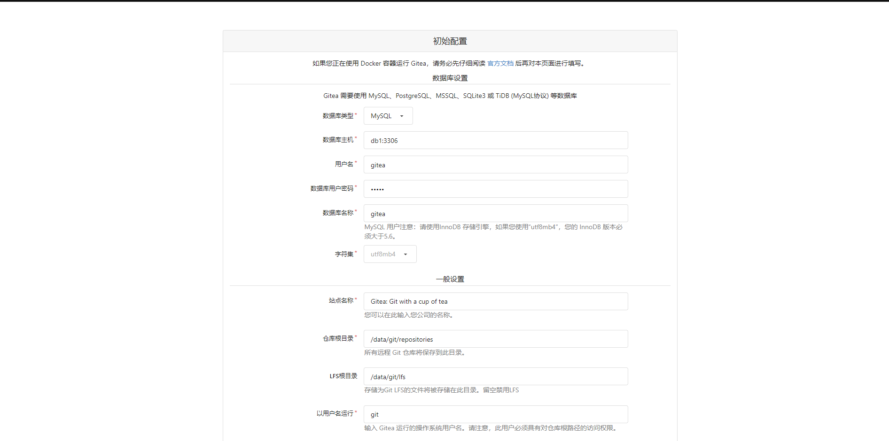
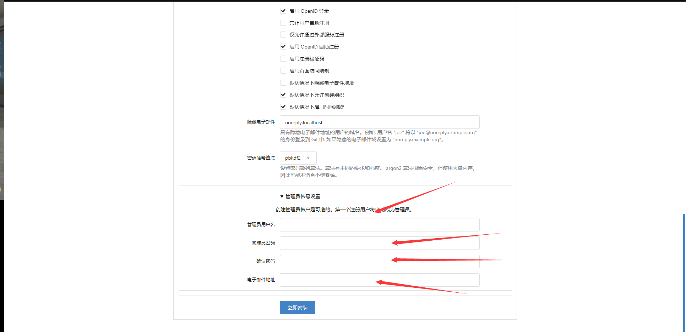

# gitea服务安装配置

## 前言

关于gitea是什么，以及基本的配置可以参考[官方文档](https://docs.gitea.com/zh-cn/)

## 特性

- 此为内网使用，因而没有配置caddy或nginx等代理

## 配置

### 1.启动docker服务

```bash
docker-compose up -d
```

### 2.IP:port通过浏览器配置



